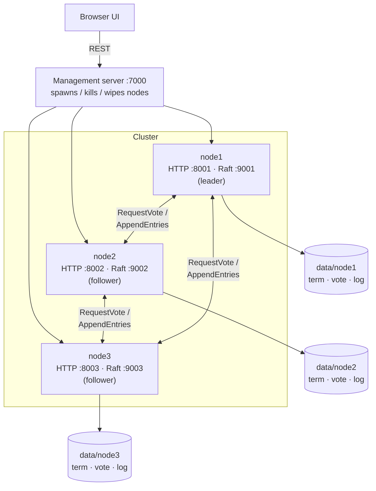
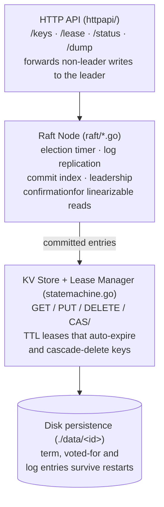

# DCS — Distributed Coordination Service

A Raft-based replicated key-value store with TTL leases, written from scratch in Go. It provides the
primitives behind real coordination services like etcd/ZooKeeper — consensus, linearizable reads,
compare-and-swap, and leases — and ships with a browser UI for spinning up a local cluster and
poking at it (killing nodes, wiping state, watching elections happen in real time).

## Architecture

Within a node, requests flow down through an HTTP façade, the Raft engine, and into the replicated
state machine:

## Design

- **Raft consensus from scratch** (`raft/`) — leader election with randomized timeouts, log
  replication with AppendEntries/heartbeats, and commit-index advancement, all driven over Go's
  `net/rpc`.
- **Disk persistence** (`raft/persist.go`) — term, vote, and log are flushed to disk per node so a
  restarted node recovers its state instead of starting fresh.
- **Linearizable reads** — the leader confirms it still holds leadership (a quorum check) before
  serving a read, so followers never see stale data through a partitioned "leader".
- **Replicated KV store with leases** (`raft/statemachine.go`) — supports `GET`/`PUT`/`DELETE` and
  atomic `CAS` (compare-and-swap), plus etcd-style TTL leases that auto-expire and cascade-delete
  their attached keys — the building blocks for distributed locks and leader election.
- **HTTP API** (`httpapi/`) — a REST layer per node that proposes commands to the Raft log and
  transparently forwards writes to the current leader.
- **Cluster simulator UI** (`frontend/`) — spins up 1–10 nodes, shows live state (term, log length,
  commit index, current leader), and lets you kill/restart/wipe individual nodes to watch the
  cluster recover.

## Usage

1. `go run .` — starts the management server on `localhost:7000` (one process hosts all simulated
   nodes; each node also gets its own Raft port `900x` and HTTP port `800x`).
2. Open `frontend/index.html` in a browser, enter a node count (1–10), and click **Start**.
3. Use the UI to issue KV/lease operations against any node — writes are forwarded to the leader
   automatically. Required fields for each operation are listed next to its button.
4. **Kill** / **Restart** simulate node crashes and recovery; **Wipe** clears a node's persisted
   state (written under `/data`).
5. `Ctrl+C` shuts down every node and removes all persisted state. Restarting the cluster requires
   re-running `go run .` and refreshing the browser.
